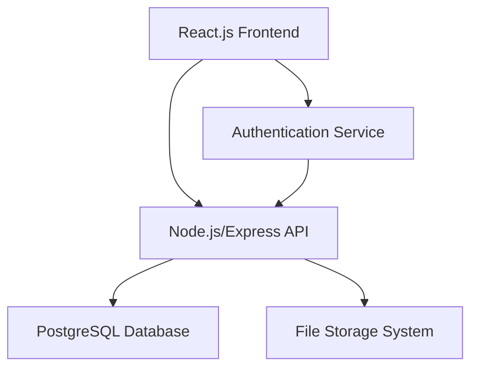

# Design Document

## Overview

The laundry management system is a full-stack web application built with a modern three-tier architecture: React.js frontend, Node.js/Express.js API backend, and PostgreSQL database. The system provides comprehensive order management, expense tracking, and business analytics for laundry operations.

## Architecture

### System Architecture



### Technology Stack

- **Frontend**: React.js with modern hooks, React Router for navigation, Axios for API calls
- **Backend**: Node.js with Express.js framework, Basic Authentication with sessions
- **Database**: PostgreSQL with connection pooling
- **File Storage**: Local file system for bill attachments (with option to migrate to cloud storage)
- **Authentication**: Basic Authentication with server-side session management

## Components and Interfaces

### Frontend Components

#### Authentication Components
- `LoginForm`: Handles user authentication with username/password using Basic Auth
- `ProtectedRoute`: Wrapper component for authenticated routes
- `AuthContext`: React context for managing authentication state and Basic Auth headers

#### Dashboard Components
- `Dashboard`: Main dashboard container
- `BusinessMetrics`: Displays revenue and order analytics
- `ExpenseMetrics`: Shows expense summaries
- `TimeFilter`: Date range selector (daily/weekly/monthly)

#### Order Management Components
- `OrderForm`: Form for creating new orders
- `OrderTable`: Displays orders with filtering capabilities
- `OrderDetails`: Shows detailed order information
- `StatusUpdater`: Component for updating order status

#### Expense Management Components
- `ExpenseForm`: Form for adding expenses
- `ExpenseList`: Displays expense records
- `FileUpload`: Handles bill attachment uploads

### Backend API Endpoints

#### Authentication Endpoints
- `POST /api/auth/login` - User authentication with Basic Auth credentials
- `POST /api/auth/logout` - User logout and session cleanup
- `GET /api/auth/status` - Check authentication status

#### Order Management Endpoints
- `GET /api/orders` - Retrieve orders with optional filtering
- `POST /api/orders` - Create new order
- `PUT /api/orders/:id` - Update order details
- `PATCH /api/orders/:id/status` - Update order status
- `GET /api/orders/:id` - Get specific order details

#### Expense Management Endpoints
- `GET /api/expenses` - Retrieve expenses
- `POST /api/expenses` - Create new expense
- `POST /api/expenses/:id/attachment` - Upload bill attachment

#### Analytics Endpoints
- `GET /api/analytics/business` - Business metrics by time period
- `GET /api/analytics/expenses` - Expense analytics by time period

## Data Models

### Database Schema

#### Users Table
```sql
CREATE TABLE users (
    id SERIAL PRIMARY KEY,
    username VARCHAR(50) UNIQUE NOT NULL,
    password_hash VARCHAR(255) NOT NULL,
    created_at TIMESTAMP DEFAULT CURRENT_TIMESTAMP,
    updated_at TIMESTAMP DEFAULT CURRENT_TIMESTAMP
);
```

#### Orders Table
```sql
CREATE TABLE orders (
    id SERIAL PRIMARY KEY,
    order_number VARCHAR(20) UNIQUE NOT NULL,
    customer_name VARCHAR(100) NOT NULL,
    contact_number VARCHAR(15) NOT NULL,
    order_date DATE NOT NULL,
    status VARCHAR(20) DEFAULT 'Pending',
    total_amount DECIMAL(10,2) DEFAULT 0,
    created_at TIMESTAMP DEFAULT CURRENT_TIMESTAMP,
    updated_at TIMESTAMP DEFAULT CURRENT_TIMESTAMP
);
```

#### Order Services Table
```sql
CREATE TABLE order_services (
    id SERIAL PRIMARY KEY,
    order_id INTEGER REFERENCES orders(id) ON DELETE CASCADE,
    service_type VARCHAR(50) NOT NULL, -- 'ironing', 'washing', 'dryclean', 'stain_removal'
    cloth_type VARCHAR(50) NOT NULL, -- 'saari', 'normal', 'others'
    quantity INTEGER NOT NULL,
    unit_cost DECIMAL(8,2) NOT NULL,
    total_cost DECIMAL(10,2) GENERATED ALWAYS AS (quantity * unit_cost) STORED
);
```

#### Expenses Table
```sql
CREATE TABLE expenses (
    id SERIAL PRIMARY KEY,
    expense_id VARCHAR(20) UNIQUE NOT NULL,
    expense_type VARCHAR(100) NOT NULL,
    amount DECIMAL(10,2) NOT NULL,
    bill_attachment VARCHAR(255),
    expense_date DATE NOT NULL,
    created_at TIMESTAMP DEFAULT CURRENT_TIMESTAMP
);
```

### Data Transfer Objects (DTOs)

#### Order Creation DTO
```typescript
interface CreateOrderDTO {
    customerName: string;
    contactNumber: string;
    orderDate: string;
    services: {
        serviceType: 'ironing' | 'washing' | 'dryclean' | 'stain_removal';
        clothType: 'saari' | 'normal' | 'others';
        quantity: number;
        unitCost: number;
    }[];
}
```

#### Business Analytics DTO
```typescript
interface BusinessAnalyticsDTO {
    period: 'daily' | 'weekly' | 'monthly';
    totalRevenue: number;
    totalOrders: number;
    completedOrders: number;
    pendingOrders: number;
    averageOrderValue: number;
}
```

## Error Handling

### Frontend Error Handling
- Global error boundary for React components
- API error interceptors with user-friendly messages
- Form validation with real-time feedback
- Loading states and error states for all async operations

### Backend Error Handling
- Centralized error handling middleware
- Input validation using express-validator
- Database error handling with appropriate HTTP status codes
- File upload error handling with size and type restrictions

### Error Response Format
```typescript
interface ErrorResponse {
    success: false;
    error: {
        code: string;
        message: string;
        details?: any;
    };
}
```

## Testing Strategy

### Frontend Testing
- **Unit Tests**: Jest and React Testing Library for component testing
- **Integration Tests**: Testing user workflows and API integration
- **E2E Tests**: Cypress for critical user journeys

### Backend Testing
- **Unit Tests**: Jest for individual function testing
- **Integration Tests**: Supertest for API endpoint testing
- **Database Tests**: Test database operations with test database

### Test Coverage Goals
- Minimum 80% code coverage for critical business logic
- 100% coverage for authentication and payment processing
- Integration tests for all API endpoints

### Testing Data
- Mock data generators for consistent test scenarios
- Database seeding scripts for development and testing
- Automated test data cleanup

## Security Considerations

### Authentication & Authorization
- Basic Authentication with Base64 encoded credentials
- Password hashing using bcrypt for database storage
- Server-side session management with express-session
- Rate limiting on authentication endpoints
- Session cookies with secure flags and appropriate expiration

### Data Protection
- Input sanitization and validation
- SQL injection prevention using parameterized queries
- File upload restrictions (type, size, location)
- CORS configuration for frontend-backend communication

### Infrastructure Security
- Environment variable management for sensitive data
- Database connection security
- HTTPS enforcement in production
- Regular security dependency updates