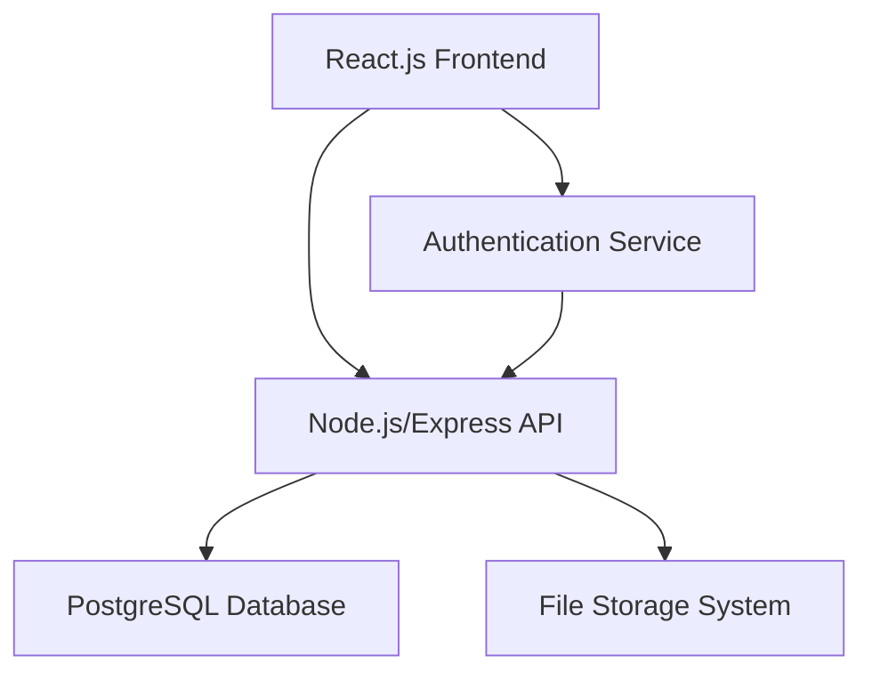

# Product Overview

## Laundry Management System

A comprehensive web application designed to streamline daily operations for laundry businesses. The system provides complete business management capabilities including order processing, expense tracking, customer management, and business analytics.

## Core Features

- **Order Management**: Create, track, and manage customer orders with detailed service specifications (washing, ironing, dry cleaning, stain removal)
- **Billing System**: Automated bill generation with itemized services and pricing
- **Expense Tracking**: Record and categorize business expenses with document attachments
- **Business Analytics**: Dashboard with revenue metrics, order statistics, and performance insights
- **Customer Management**: Track customer information and order history
- **Status Tracking**: Monitor order progress from pending to completed to paid

## Target Users

- Laundry business owners
- Service managers
- Front desk employees
- Administrative staff

## Business Model

The system handles various laundry services with flexible pricing:
- Cloth types: Saari, normal clothes, specialty items
- Services: Washing, ironing, dry cleaning, stain removal
- Pricing: Per-unit costs for each service type
- Payment tracking: Pending, completed, paid status workflow

 # Technology Stack

## Architecture

Full-stack web application with separate frontend and backend services, containerized for production deployment.

## Backend Stack

- **Runtime**: Node.js 18
- **Framework**: Express.js 4.18
- **Database**: PostgreSQL 15
- **Authentication**: Express sessions with bcrypt password hashing
- **Security**: Helmet, CORS, rate limiting, compression
- **File Uploads**: Multer middleware
- **Testing**: Jest with Supertest
- **Process Management**: PM2 (production)

## Frontend Stack

- **Framework**: React 18 with React Router DOM
- **Build Tool**: Vite 4
- **Styling**: Tailwind CSS 3
- **Icons**: Heroicons React
- **HTTP Client**: Axios
- **Testing**: Jest with React Testing Library
- **E2E Testing**: Cypress

## Development Tools

- **Package Manager**: npm
- **Development Server**: Nodemon (backend), Vite dev server (frontend)
- **Code Quality**: ESLint, Prettier (implied from structure)
- **Environment**: dotenv for configuration

## Deployment & Infrastructure

- **Containerization**: Docker with multi-stage builds
- **Orchestration**: Docker Compose
- **Reverse Proxy**: Nginx
- **SSL**: Nginx with SSL termination
- **Database**: PostgreSQL with persistent volumes
- **File Storage**: Local filesystem with Docker volumes

## Common Commands

### Backend Development
```bash
cd backend
npm run dev          # Start development server with nodemon
npm test            # Run Jest tests
npm run init-db     # Initialize database schema
npm start           # Production start
```

### Frontend Development
```bash
cd frontend
npm run dev         # Start Vite development server
npm run build       # Production build
npm test           # Run Jest tests
npm run test:e2e   # Run Cypress E2E tests
```

### Production Deployment
```bash
# Setup and deploy
docker-compose -f docker-compose.prod.yml up -d
npm run prod:setup  # Both frontend and backend
npm run prod:deploy # Both frontend and backend
```

### Database Operations
```bash
cd backend
npm run init-db              # Initialize database
node scripts/create-test-user.js  # Create test user
```

## Environment Configuration

- Development: `.env` files in both frontend and backend
- Production: `.env.production` files with Docker environment variables
- Template: `.env.production.template` for reference

# Project Structure

## Root Level Organization

```
├── backend/           # Node.js Express API server
├── frontend/          # React application
├── deployment/        # Nginx configuration files
├── .kiro/            # Kiro IDE configuration and specs
├── docker-compose.prod.yml  # Production deployment
├── Dockerfile.backend       # Backend container build
├── Dockerfile.frontend      # Frontend container build
└── DEPLOYMENT.md           # Deployment documentation
```

## Backend Structure (`/backend`)

```
backend/
├── config/           # Configuration modules
│   ├── cors.js      # CORS settings
│   ├── database.js  # PostgreSQL connection
│   └── security.js  # Security middleware configs
├── middleware/       # Express middleware
│   ├── auth.js      # Authentication middleware
│   ├── errorHandler.js  # Error handling
│   ├── upload.js    # File upload handling
│   └── validation.js    # Request validation
├── models/          # Database models
│   ├── User.js      # User model
│   ├── Order.js     # Order model
│   └── Expense.js   # Expense model
├── routes/          # API route handlers
│   ├── auth.js      # Authentication routes
│   ├── orders.js    # Order management
│   ├── expenses.js  # Expense tracking
│   └── analytics.js # Business analytics
├── scripts/         # Utility scripts
│   ├── init-db.js   # Database initialization
│   ├── create-test-user.js  # Test user creation
│   └── production-deploy.js # Production deployment
├── tests/           # Test files (mirrors src structure)
├── uploads/         # File upload storage
└── server.js        # Main application entry point
```

## Frontend Structure (`/frontend`)

```
frontend/
├── src/
│   ├── components/   # React components
│   │   ├── auth/     # Authentication components
│   │   ├── common/   # Shared/reusable components
│   │   ├── dashboard/    # Dashboard components
│   │   ├── orders/   # Order management components
│   │   └── expenses/ # Expense tracking components
│   ├── contexts/     # React contexts
│   │   ├── AuthContext.jsx    # Authentication state
│   │   └── ErrorContext.jsx   # Error handling state
│   ├── hooks/        # Custom React hooks
│   ├── pages/        # Page-level components
│   │   ├── LoginPage.jsx
│   │   ├── DashboardPage.jsx
│   │   ├── OrdersPage.jsx
│   │   └── ExpensesPage.jsx
│   ├── services/     # API service modules
│   │   ├── api.js    # Base API configuration
│   │   ├── authService.js     # Authentication API
│   │   └── analyticsService.js # Analytics API
│   ├── styles/       # CSS files
│   ├── utils/        # Utility functions
│   └── App.js        # Main application component
├── cypress/          # E2E test files
└── public/           # Static assets
```

## Key Architectural Patterns

### Backend Patterns
- **MVC Architecture**: Models, routes (controllers), middleware
- **Middleware Chain**: Authentication, validation, error handling
- **Configuration Modules**: Centralized config in `/config`
- **Script Organization**: Utility scripts in `/scripts`

### Frontend Patterns
- **Component Hierarchy**: Pages > Feature Components > Common Components
- **Context Providers**: Centralized state management
- **Custom Hooks**: Reusable logic extraction
- **Service Layer**: API calls abstracted into services
- **Lazy Loading**: Code splitting for performance

### File Naming Conventions
- **Backend**: camelCase for files, PascalCase for models
- **Frontend**: PascalCase for components, camelCase for utilities
- **Tests**: Mirror source structure with `.test.js` suffix
- **Configuration**: kebab-case for config files

### Import/Export Patterns
- **Backend**: CommonJS (`require`/`module.exports`)
- **Frontend**: ES6 modules (`import`/`export`)
- **Index Files**: Barrel exports in component directories

# Design Document

## Overview

The laundry management system is a full-stack web application built with a modern three-tier architecture: React.js frontend, Node.js/Express.js API backend, and PostgreSQL database. The system provides comprehensive order management, expense tracking, and business analytics for laundry operations.

## Architecture

### System Architecture



### Technology Stack

- **Frontend**: React.js with modern hooks, React Router for navigation, Axios for API calls
- **Backend**: Node.js with Express.js framework, Basic Authentication with sessions
- **Database**: PostgreSQL with connection pooling
- **File Storage**: Local file system for bill attachments (with option to migrate to cloud storage)
- **Authentication**: Basic Authentication with server-side session management

## Components and Interfaces

### Frontend Components

#### Authentication Components
- `LoginForm`: Handles user authentication with username/password using Basic Auth
- `ProtectedRoute`: Wrapper component for authenticated routes
- `AuthContext`: React context for managing authentication state and Basic Auth headers

#### Dashboard Components
- `Dashboard`: Main dashboard container
- `BusinessMetrics`: Displays revenue and order analytics
- `ExpenseMetrics`: Shows expense summaries
- `TimeFilter`: Date range selector (daily/weekly/monthly)

#### Order Management Components
- `OrderForm`: Form for creating new orders
- `OrderTable`: Displays orders with filtering capabilities
- `OrderDetails`: Shows detailed order information
- `StatusUpdater`: Component for updating order status

#### Expense Management Components
- `ExpenseForm`: Form for adding expenses
- `ExpenseList`: Displays expense records
- `FileUpload`: Handles bill attachment uploads

### Backend API Endpoints

#### Authentication Endpoints
- `POST /api/auth/login` - User authentication with Basic Auth credentials
- `POST /api/auth/logout` - User logout and session cleanup
- `GET /api/auth/status` - Check authentication status

#### Order Management Endpoints
- `GET /api/orders` - Retrieve orders with optional filtering
- `POST /api/orders` - Create new order
- `PUT /api/orders/:id` - Update order details
- `PATCH /api/orders/:id/status` - Update order status
- `GET /api/orders/:id` - Get specific order details

#### Expense Management Endpoints
- `GET /api/expenses` - Retrieve expenses
- `POST /api/expenses` - Create new expense
- `POST /api/expenses/:id/attachment` - Upload bill attachment

#### Analytics Endpoints
- `GET /api/analytics/business` - Business metrics by time period
- `GET /api/analytics/expenses` - Expense analytics by time period

## Data Models

### Database Schema

#### Users Table
```sql
CREATE TABLE users (
    id SERIAL PRIMARY KEY,
    username VARCHAR(50) UNIQUE NOT NULL,
    password_hash VARCHAR(255) NOT NULL,
    created_at TIMESTAMP DEFAULT CURRENT_TIMESTAMP,
    updated_at TIMESTAMP DEFAULT CURRENT_TIMESTAMP
);
```

#### Orders Table
```sql
CREATE TABLE orders (
    id SERIAL PRIMARY KEY,
    order_number VARCHAR(20) UNIQUE NOT NULL,
    customer_name VARCHAR(100) NOT NULL,
    contact_number VARCHAR(15) NOT NULL,
    order_date DATE NOT NULL,
    status VARCHAR(20) DEFAULT 'Pending',
    total_amount DECIMAL(10,2) DEFAULT 0,
    created_at TIMESTAMP DEFAULT CURRENT_TIMESTAMP,
    updated_at TIMESTAMP DEFAULT CURRENT_TIMESTAMP
);
```

#### Order Services Table
```sql
CREATE TABLE order_services (
    id SERIAL PRIMARY KEY,
    order_id INTEGER REFERENCES orders(id) ON DELETE CASCADE,
    service_type VARCHAR(50) NOT NULL, -- 'ironing', 'washing', 'dryclean', 'stain_removal'
    cloth_type VARCHAR(50) NOT NULL, -- 'saari', 'normal', 'others'
    quantity INTEGER NOT NULL,
    unit_cost DECIMAL(8,2) NOT NULL,
    total_cost DECIMAL(10,2) GENERATED ALWAYS AS (quantity * unit_cost) STORED
);
```

#### Expenses Table
```sql
CREATE TABLE expenses (
    id SERIAL PRIMARY KEY,
    expense_id VARCHAR(20) UNIQUE NOT NULL,
    expense_type VARCHAR(100) NOT NULL,
    amount DECIMAL(10,2) NOT NULL,
    bill_attachment VARCHAR(255),
    expense_date DATE NOT NULL,
    created_at TIMESTAMP DEFAULT CURRENT_TIMESTAMP
);
```

### Data Transfer Objects (DTOs)

#### Order Creation DTO
```typescript
interface CreateOrderDTO {
    customerName: string;
    contactNumber: string;
    orderDate: string;
    services: {
        serviceType: 'ironing' | 'washing' | 'dryclean' | 'stain_removal';
        clothType: 'saari' | 'normal' | 'others';
        quantity: number;
        unitCost: number;
    }[];
}
```

#### Business Analytics DTO
```typescript
interface BusinessAnalyticsDTO {
    period: 'daily' | 'weekly' | 'monthly';
    totalRevenue: number;
    totalOrders: number;
    completedOrders: number;
    pendingOrders: number;
    averageOrderValue: number;
}
```

## Error Handling

### Frontend Error Handling
- Global error boundary for React components
- API error interceptors with user-friendly messages
- Form validation with real-time feedback
- Loading states and error states for all async operations

### Backend Error Handling
- Centralized error handling middleware
- Input validation using express-validator
- Database error handling with appropriate HTTP status codes
- File upload error handling with size and type restrictions

### Error Response Format
```typescript
interface ErrorResponse {
    success: false;
    error: {
        code: string;
        message: string;
        details?: any;
    };
}
```

## Testing Strategy

### Frontend Testing
- **Unit Tests**: Jest and React Testing Library for component testing
- **Integration Tests**: Testing user workflows and API integration
- **E2E Tests**: Cypress for critical user journeys

### Backend Testing
- **Unit Tests**: Jest for individual function testing
- **Integration Tests**: Supertest for API endpoint testing
- **Database Tests**: Test database operations with test database

### Test Coverage Goals
- Minimum 80% code coverage for critical business logic
- 100% coverage for authentication and payment processing
- Integration tests for all API endpoints

### Testing Data
- Mock data generators for consistent test scenarios
- Database seeding scripts for development and testing
- Automated test data cleanup

## Security Considerations

### Authentication & Authorization
- Basic Authentication with Base64 encoded credentials
- Password hashing using bcrypt for database storage
- Server-side session management with express-session
- Rate limiting on authentication endpoints
- Session cookies with secure flags and appropriate expiration

### Data Protection
- Input sanitization and validation
- SQL injection prevention using parameterized queries
- File upload restrictions (type, size, location)
- CORS configuration for frontend-backend communication

### Infrastructure Security
- Environment variable management for sensitive data
- Database connection security
- HTTPS enforcement in production
- Regular security dependency updates
